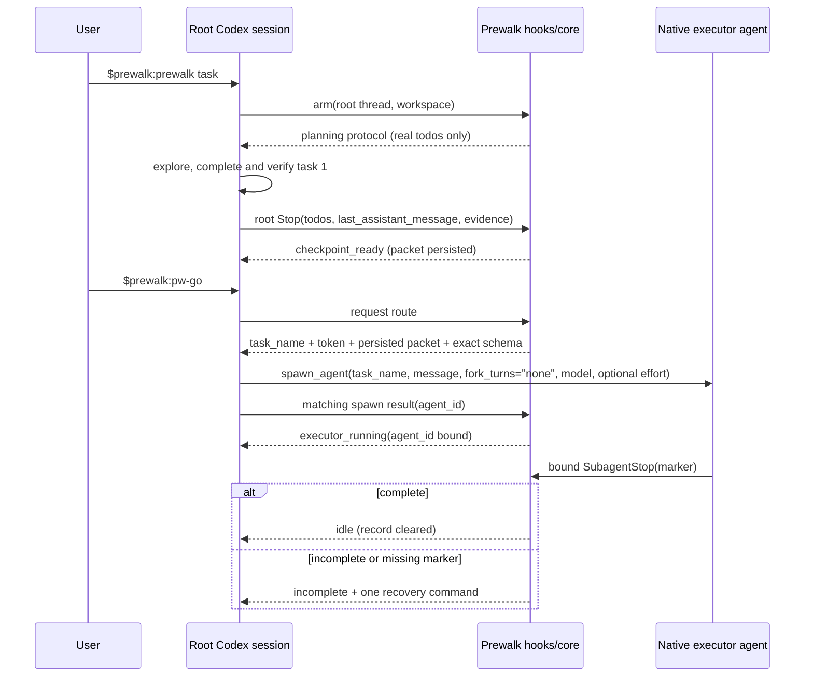
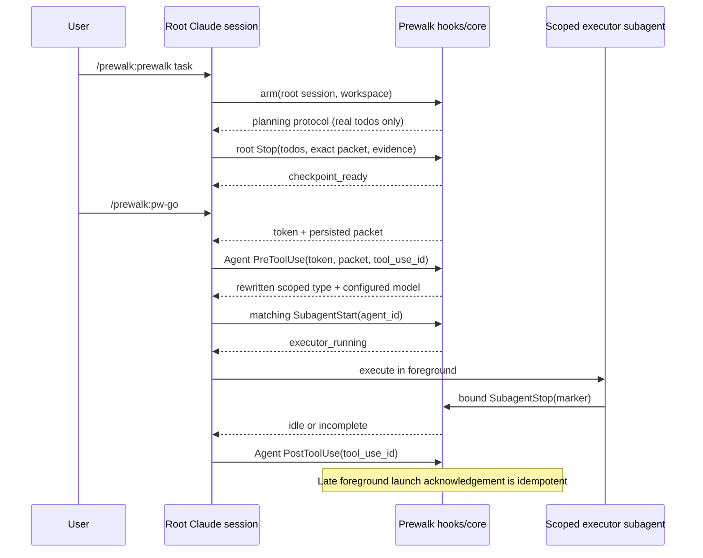
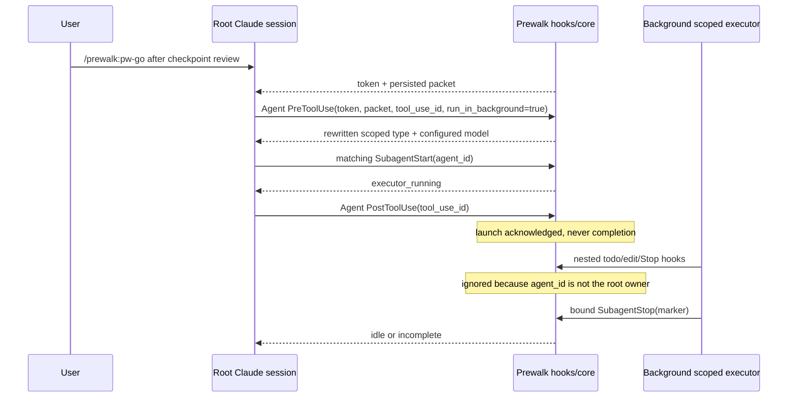

# ADR 0001: Prewalk v4 Native Planner-to-Executor Workflow

- Status: Accepted
- Date: 2026-08-20
- Milestone: 0.4.0
- Issue: #5

## Context

Prewalk 0.3.x encodes handoff readiness with a model-authored `PAUSE` todo,
advertises a configured planner even though a skill cannot change the active
root model, and leaves the full handoff packet in conversation context. Those
choices make delayed review, compaction, resume, and native subagent lifecycle
events difficult to reconcile safely.

Version 4 uses the host's active root session as the planner. Prewalk records a
durable checkpoint at root `Stop`, then routes exactly one executor from that
checkpoint. Todos describe work only. Control state belongs in the persisted
state machine.

This ADR is normative for every 0.4.0 implementation issue. Host adapters may
normalize different payload shapes, but they must not add another state owner,
infer a packet from transcript history, or weaken an invariant below.

## Decision

### Root session and presets

The active root session is always the planner. Prewalk never switches it and
never reports a preset planner as active. A v4 preset contains:

- `executor`: host-resolvable executor model;
- `executor_effort`: optional effort requested only when the live host schema
  exposes an equivalent control;
- `max_todos`: cap on real work items;
- `handoff_mode`: `auto`, `spawn`, or `manual-model`;
- `require_model_routing`: fail closed when the configured model cannot be
  proven on the requested route.

Legacy `planner` and `planner_thinking` fields load as ignored fields with a
deprecation warning. They never change or describe the active root model.

### Public phases

The persisted phase is one of:

| Phase | Meaning | Valid user action |
| --- | --- | --- |
| `planning` | Root session is exploring, planning real work, and completing task 1. | Continue planning, or `pw-off`. |
| `checkpoint_ready` | Root `Stop` persisted a valid packet and review is pending. | `pw-go`, `pw-revise`, or `pw-off`. |
| `handoff_requested` | One route token exists; the matching native spawn has not yet bound an agent. | Complete the requested spawn, `pw-retry`, or `pw-off`. |
| `executor_running` | The matching native agent ID is bound. | Wait, inspect with `pw-status`, or explicitly reconcile after interruption. |
| `incomplete` | The route ended without a complete result and remains retryable from the same checkpoint. | `pw-retry`, `pw-revise`, or `pw-off`. |
| `stale` | A timeout/restart left an ambiguous route that Prewalk will not clear automatically. | `pw-reconcile`, then retry/revise/off as reported. |
| `idle` | No v4 record exists for the root session. | `prewalk` to arm a new run. |

`idle` is represented by the absence of a session record. Terminal completion
deletes the record only after consuming a completion marker from the bound
agent. Disarm also deletes it, but is always an explicit user action.

### Durable checkpoint

Every v4 state record is keyed by root session ID and stores its schema version,
workspace identity, host, phase, normalized real todos, full packet, evidence,
route identities, timestamps, and last error. The complete field contract is
owned by #11.

Root `Stop` is the only owner of `planning -> checkpoint_ready`. It accepts a
checkpoint only when all of these conditions hold:

1. The event belongs to the armed root session, not a subagent.
2. The todo snapshot contains only real work, is within `max_todos`, and has a
   stable ID and actionable verification criterion for every item.
3. Task 1 is completed and at least two real tasks remain.
4. `last_assistant_message` contains the required packet headings: `Goal`,
   `Files Read`, `Constraints And Existing Patterns`, `Full Todo List`,
   `Task 1 Changes`, `Verification Already Run`, `Remaining Work`, and
   `Risks / Do Not Repeat`.
5. Verification evidence was observed from successful native tool results, or
   the packet carries an explicit unverified warning. The latter is persisted
   as a warning and must never be described as verified.

The exact `last_assistant_message`, normalized todos, and evidence are written
atomically in one transition. `pw-go` reads only that record. It never asks the
model to reconstruct a packet and never reads transcript/rollout internals.

If zero or one real tasks remain, root `Stop` keeps work in the current planner
session and clears the armed record with an explanatory message. A trivial task
that never creates a plan follows the same root-session path.

### Route identity

Each handoff attempt creates exactly one cryptographically random route token
and one deterministic, attempt-scoped task name. The token is secret routing
material: status may show a short fingerprint but never the full token. A route
may bind at most one tool-use ID and one native agent ID.

An event can change route state only when all identities available on that host
match the persisted root session, workspace, route token/task name, tool-use
ID, and agent ID. Missing required identity fails closed. Foreign, nested,
parallel, and duplicate events are no-ops except for an audit timestamp.

The executor always receives the persisted packet plus the remaining real todo
snapshot. It is instructed not to repeat task 1 and to finish with exactly one
marker:

- `PREWALK_COMPLETE`
- `PREWALK_INCOMPLETE: <reason>`

Only the bound agent's native `SubagentStop` message owns the result transition.
A spawn/Agent `PostToolUse` can acknowledge launch and bind a returned agent ID;
it cannot complete the run.

### Transition ownership and recovery

Each transition has exactly one owner and one recovery action:

| From | Event owner | Condition | To | Recovery / next action |
| --- | --- | --- | --- | --- |
| `idle` | `prewalk` skill | Valid arm request and root identity | `planning` | Fix config or identity, then run `prewalk` again. |
| `planning` | root `Stop` | Valid durable checkpoint | `checkpoint_ready` | Fix the reported packet/todo/evidence defect and stop again. |
| `planning` | root `Stop` | Trivial or <=1 remaining | `idle` | Finish in the current root session. |
| `checkpoint_ready` | `pw-go` / fast Stop continuation | Review accepted and route capability is usable | `handoff_requested` | Fix capability/config and rerun `pw-go`; packet is retained. |
| `checkpoint_ready` | `pw-revise` | User requests revision | `planning` | Revise only affected work; root Stop captures a replacement checkpoint. |
| `handoff_requested` | matching spawn launch event | Required token/task/tool identity and route are proven | `executor_running` | Launch/permission/model failure becomes `incomplete`; run `pw-retry`. |
| `executor_running` | bound `SubagentStop` | `PREWALK_COMPLETE` | `idle` | None; record is cleared. |
| `executor_running` | bound `SubagentStop` | Incomplete or missing marker | `incomplete` | Run `pw-retry`, `pw-revise`, or `pw-off`. |
| `handoff_requested` or `executor_running` | `pw-reconcile` | Native runtime proves interruption/no live bound agent | `incomplete` | Run `pw-retry`; never repeat task 1. |
| `handoff_requested` or `executor_running` | stale detector | Deadline elapsed but liveness is unknown | `stale` | Run `pw-reconcile`; never kill or clear an unknown agent. |
| `incomplete` | `pw-retry` | Checkpoint still valid and no bound live agent | `handoff_requested` | Correct the reported route failure and retry. |
| any non-idle | `pw-off` | Explicit user disarm | `idle` | None; no agent is terminated and no files/todos are changed. |

Repeated events are idempotent. In particular, duplicate launch/start events
cannot increment attempts, duplicate stop events cannot clear a newer attempt,
and `pw-retry` cannot create a second route while an agent may still be live.

### Codex sequence

Codex must use the live native `spawn_agent` schema. `reasoning_effort` is
included only when that schema exposes it. Required model routing fails closed
when `model` is unavailable. The unused v3 executor TOML is removed or replaced
by one instruction asset consumed by the route.

If Codex reports spawn failure, permission denial, or interruption before an
agent is bound, the attempt becomes `incomplete`. If interruption occurs after
binding and the runtime omits `SubagentStop`, the record becomes `stale` until
`pw-reconcile` proves there is no live bound agent.

### Claude foreground sequence

Claude routes only the intended token-bearing Agent call. The PreToolUse hook
preserves valid input fields while setting the exact scoped
`prewalk:prewalk-executor` type and configured model. A conflicting
`CLAUDE_CODE_SUBAGENT_MODEL` is reported; required routing fails closed.
Dynamic executor effort is unsupported unless Claude exposes a future native
control, so it cannot be reported as applied.

### Claude background sequence

Background execution has the same state transitions. The only ordering
difference is that matching Agent `PostToolUse` may acknowledge launch before
the executor finishes. Global plugin hooks invoked inside the subagent are
ignored for root checkpoint ownership.

### Commands

The public namespaced skills are retained:

| Purpose | Codex | Claude Code |
| --- | --- | --- |
| Arm | `$prewalk:prewalk` | `/prewalk:prewalk` |
| Accept checkpoint / route | `$prewalk:pw-go` | `/prewalk:pw-go` |
| Revise checkpoint | `$prewalk:pw-revise` | `/prewalk:pw-revise` |
| Inspect state | `$prewalk:pw-status` | `/prewalk:pw-status` |
| Diagnose host and config | `$prewalk:pw-doctor` | `/prewalk:pw-doctor` |
| Retry an incomplete attempt | `$prewalk:pw-retry` | `/prewalk:pw-retry` |
| Reconcile an ambiguous route | `$prewalk:pw-reconcile` | `/prewalk:pw-reconcile` |
| Disarm | `$prewalk:pw-off` | `/prewalk:pw-off` |

`pw-resume` remains a compatibility alias for the manual route where needed,
but status must recommend the canonical v4 action (`pw-retry` or
`pw-reconcile`). `--fast` skips human review only: root Stop still validates
and persists the same checkpoint before requesting the same route.

### State version boundary

There is no migration of an active v3/0.3.x handoff. On first access, a v4
adapter detects a record without `schema_version: 4`, removes only that root
session's old record under the store lock, and reports:

> Prewalk reset an incompatible 0.3.x run. Re-arm with the namespaced prewalk
> command; no worktree files or host todos were changed.

Corrupt records are quarantined. Partial, invariant-violating, and stale v4
records return deterministic status plus exactly one safe next command. They
are never silently treated as a valid checkpoint.

## Consequences

- Handoff survives compaction, process restart, and session resume because the
  exact packet and todos are durable.
- The user's task list contains no control pseudo-todo.
- Both hosts share one state machine while retaining native capability and
  event-order differences.
- Additional hook plumbing and schema-derived fixtures are required, especially
  for Codex spawn and subagent lifecycle events.
- Existing in-progress 0.3.x runs are intentionally reset rather than migrated.

## Implementation mapping

- #11 owns the v4 record, invariants, locking, reset, and durable packet.
- #14 owns root Stop checkpoint capture and removal of PAUSE semantics.
- #8 owns presets and capability reporting.
- #13 owns Codex route orchestration.
- #15 owns Claude route orchestration.
- #3 owns status, doctor, retry, reconcile, and stale behavior.
- #12 owns schema-derived native integration fixtures and CI.
- #9 owns migration documentation, release metadata, and the `v0.4.0` tag.

Any implementation change that needs a second transition owner, transcript
recovery, an automatic unknown-agent termination, or a PAUSE todo requires a
new ADR that supersedes this one.
